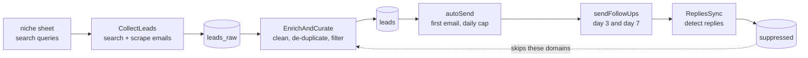

# sponsor-outreach-automation

**A Google Sheets + Apps Script bot for sponsor outreach.** Find brand contacts, clean the list, send a first email, follow up on schedule, and stop when someone replies.

-lightgrey)

---

> ### ⚠️ Read this first: the search API is being retired
> Lead discovery uses the **Google Custom Search JSON API**. According to [Google's documentation](https://developers.google.com/custom-search/v1/overview), that API is **closed to new customers** and will be **discontinued on January 1, 2027**. If you already have an API key and Search Engine ID, the tool works until then. If you do not, you need another search source. The search call lives in **one function**, `cseSearch_()`, and it only has to return a list of URLs, so swapping providers is a small change. See [Replacing the search provider](#replacing-the-search-provider).

## In plain words

Reaching out to sponsors by hand means searching for brands, hunting for a contact email on each website, copying it into a sheet, sending emails, remembering who to follow up with, and remembering who already said no.

This script does that inside a Google Sheet you own. There is **no server** to run and **no database**. Everything is stored in sheet tabs you can read and edit.

## How it works

## Features

- **Niche-based discovery.** Define search queries plus include/exclude words per niche, then switch niches with one cell.
- **Email finder.** Checks the result page and common pages (`/contact`, `/about`, `/partners`, …) for addresses. Ignores image file names and tracking-beacon addresses.
- **List cleaning.** Removes duplicates, social-media and app-store hosts, and role addresses like `no-reply@` and `abuse@`.
- **Daily send cap.** Set how many emails go out per day.
- **Automatic follow-ups.** Two follow-ups after configurable delays (default 3 and 7 days).
- **Reply detection.** Reads your Gmail, marks the lead `replied`, and adds the domain to the suppression list.
- **Kill switch.** `pauseBot()` and `resumeBot()` stop and start sending instantly.
- **Full audit trail.** Every lead, status, stage, and timestamp is a visible row.

## Requirements

- A Google account (Gmail or Google Workspace)
- A Google Sheet
- A **Custom Search JSON API key** and a **Programmable Search Engine ID** (see the warning above), or your own replacement search function

No packages, no `npm`, no `pip`.

## Setup (about 10 minutes)

### 1. Create the sheet and paste the code

1. Create a new Google Sheet.
2. Open **Extensions → Apps Script**.
3. Delete the sample code, paste the contents of `sponsor_outreach.gs`, and click **Save**.

### 2. Create the `config` tab (required)

Create a tab named exactly `config`. Column A is the key. Column B is the value.

| Row | A: key | B: example value | Meaning |
|---|---|---|---|
| 1 | key | value | Header |
| **2** | `pause_flag` | `0` | `1` pauses sending. **Must be in row 2.** |
| **3** | `sender_email` | `you@gmail.com` | Your address, used to detect replies. **Must be in row 3.** |
| 4 | `daily_cap` | `10` | Max first emails per day |
| 5 | `fu_days` | `3,7` | Days to wait before follow-up 1 and follow-up 2 |
| 6 | `cse_key` | *your API key* | Custom Search API key |
| 7 | `cse_id` | *your engine ID* | Programmable Search Engine ID (`cx`) |
| 8 | `active_niche` | `gaming` | Which row of the `niche` tab to use |

Rows 2 and 3 are fixed because `pauseBot()`, `resumeBot()`, and `RepliesSync()` read those cells directly. The other keys can be in any order.

> **Keep your API key private.** Do not share this sheet publicly. Better still, keep the key in **Project Settings → Script properties** and read it from there.

### 3. Create the `niche` tab (recommended)

| A: niche | B: queries (comma separated) | C: include words | D: exclude words |
|---|---|---|---|
| `gaming` | `game sponsorship email, gaming brand partnerships` | `partnership, sponsor` | `jobs, careers` |

The script adds include words as `"word"` and exclude words as `-"word"` to every query. If this tab is missing, two generic queries are used.

### 4. Edit your email text

Open `sponsor_outreach.gs` and find `_pickTemplateFor()`. It holds three templates: first email, follow-up 1, and follow-up 2.

- **Replace the placeholder `User`** with your real name, channel, or company.
- Rewrite the sentence about what you do so it fits your niche.
- **Add an opt-out line** (for example, "Reply STOP and I will not contact you again") and your contact details.

Placeholders like `{{ brand }}` are filled in automatically.

### 5. Authorize the script and let it create the other tabs

Run `CollectLeads` once from the Apps Script editor (select it in the function list and click **Run**). Google will ask you to authorize access. The script creates `leads_raw`, `leads`, `suppressed`, and `state` automatically the first time each function needs them.

You may add domains to `suppressed` yourself (column A) to block them.

### 6. Add triggers (automation)

In Apps Script, open **Triggers** (clock icon) → **Add trigger** and create time-based triggers like these:

| Function | Suggested schedule |
|---|---|
| `CollectLeads` | Once a day |
| `EnrichAndCurate` | Once a day, after `CollectLeads` |
| `autoSend` | Every hour |
| `sendFollowUps` | Once a day |
| `RepliesSync` | Every few hours |
| `resetDailyCounter` | Once a day, around midnight |

## Test safely first

1. Set `daily_cap` to `2`.
2. In `leads`, add a row with **your own email** in column D and status `new`.
3. Run `autoSend` by hand and check that the email looks right.
4. Only then turn on the triggers.

## Sheet reference

| Tab | Columns | Who writes it |
|---|---|---|
| `leads_raw` | brand, website, found_email, source_url, discovered_at | `CollectLeads` |
| `leads` | lead_id, brand, website, email, status, sequence_stage, queued_at, sent_at | `EnrichAndCurate`, `autoSend`, `sendFollowUps`, `RepliesSync` |
| `suppressed` | domain, reason, added_at | You, and `RepliesSync` |
| `state` | key, value (`today_sent`) | `autoSend`, `resetDailyCounter` |

**Lead status values:** `new` → `sent` → `replied`.

## Replacing the search provider

Open `cseSearch_(query, maxNum)`. It must return an **array of URL strings**. Replace the body with a call to any search API you have access to, for example Google's Vertex AI Search or a third-party search API, and keep the same return shape. Nothing else in the script needs to change.

## Troubleshooting

| Problem | Fix |
|---|---|
| "Missing sheet: config" | Create a tab named exactly `config`. |
| `CSE HTTP 403` or `429` in the log | Wrong key, API not enabled, or free quota used up. Open **Executions** to read the message. |
| No leads found | Check `active_niche` matches a row in `niche`. Make your queries broader. |
| Emails do not send | Check `pause_flag` is `0`, `daily_cap` is above `0`, and the lead has status `new`. Gmail also has daily sending limits. |
| `pauseBot()` does nothing | `pause_flag` must be in **row 2** of `config`. |
| "Exceeded maximum execution time" | Reduce the number of queries per niche. Apps Script has time and quota limits. See [Apps Script quotas](https://developers.google.com/apps-script/guides/services/quotas). |

## Known limitations

- Depends on the Custom Search JSON API until you swap the provider (see the top of this page).
- Email finding uses a simple pattern search. Some sites hide addresses, and some found addresses will be wrong.
- Google limits how many emails and web requests a script can make per day. Check your account's quotas.
- Reply detection matches on the address you wrote to. Replies from a different address are not detected.

## Responsible use

Cold email is regulated (for example CAN-SPAM in the US, GDPR/PECR in the UK and EU, CASL in Canada). Contact **business** addresses for a real business reason, identify yourself honestly, include a way to opt out, and honor every opt-out. Keep the daily cap low. You are responsible for following the laws and the terms of the services you use.

## Contributing

Issues and pull requests are welcome. Good first tasks: read `pause_flag` and `sender_email` by key instead of by cell position, move keys to Script Properties, and skip suppressed domains inside `autoSend`.

## License

MIT. See `LICENSE`. Copyright © Saumitra Tambe.
